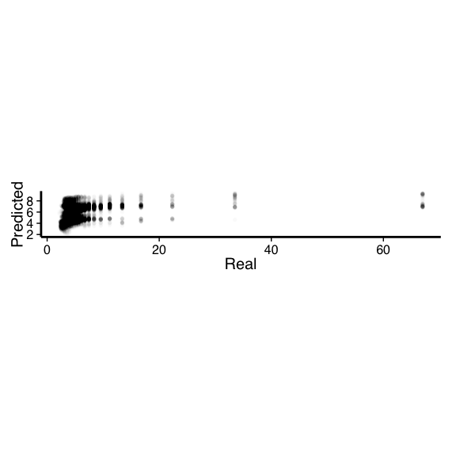
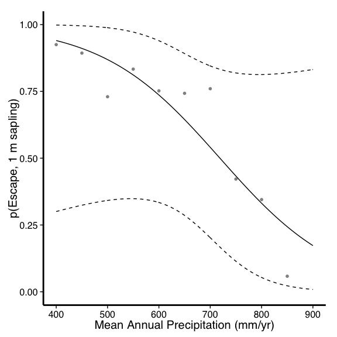

# Simple Savanna
Daniel S. Godwin  

```
## 
## Please cite as: 
## 
##  Hlavac, Marek (2014). stargazer: LaTeX code and ASCII text for well-formatted regression and summary statistics tables.
##  R package version 5.1. http://CRAN.R-project.org/package=stargazer
```

```
## Warning: package 'broom' was built under R version 3.1.2
```


```r
source("Scripts/MFRI_MAP.R")
```

```
OGR data source with driver: ESRI Shapefile 
Source: "Data/FRI/", layer: "fire return interval_1941to2006"
with 34856 features and 4 fields
Feature type: wkbPolygon with 2 dimensions
Found 34856 region(s) and 35041 polygon(s)
```

# Model Mean Fire Return Interval as a function of Mean Annual Rainfall

# Figures

### MFRI vs. MAP

 

### FF vs. MAP

 

## Model Comparison

 


<table style="text-align:center"><tr><td colspan="2" style="border-bottom: 1px solid black"></td></tr><tr><td style="text-align:left"></td><td><em>Dependent variable:</em></td></tr>
<tr><td></td><td colspan="1" style="border-bottom: 1px solid black"></td></tr>
<tr><td style="text-align:left"></td><td>FF</td></tr>
<tr><td colspan="2" style="border-bottom: 1px solid black"></td></tr><tr><td style="text-align:left">predicted</td><td>-0.019<sup>***</sup></td></tr>
<tr><td style="text-align:left"></td><td>(0.0003)</td></tr>
<tr><td style="text-align:left"></td><td></td></tr>
<tr><td style="text-align:left">Constant</td><td>0.331<sup>***</sup></td></tr>
<tr><td style="text-align:left"></td><td>(0.002)</td></tr>
<tr><td style="text-align:left"></td><td></td></tr>
<tr><td colspan="2" style="border-bottom: 1px solid black"></td></tr><tr><td style="text-align:left">Observations</td><td>24,138</td></tr>
<tr><td style="text-align:left">R<sup>2</sup></td><td>0.122</td></tr>
<tr><td style="text-align:left">Adjusted R<sup>2</sup></td><td>0.122</td></tr>
<tr><td style="text-align:left">Residual Std. Error</td><td>0.071 (df = 24136)</td></tr>
<tr><td style="text-align:left">F Statistic</td><td>3,363.000<sup>***</sup> (df = 1; 24136)</td></tr>
<tr><td colspan="2" style="border-bottom: 1px solid black"></td></tr><tr><td style="text-align:left"><em>Note:</em></td><td style="text-align:right"><sup>*</sup>p<0.1; <sup>**</sup>p<0.05; <sup>***</sup>p<0.01</td></tr>
</table>

# Model Fuel Load and Intensity as a function of MFRI and MAP


```r
source("Scripts/Intensity_MAP.R")
```


```r
sampleFillDF <- data.frame(MAP = numeric(0), MFRI_sample = numeric(0), FL = numeric(0), FL = numeric(0), FuelMoisture = numeric(0), RelativeHumidity = numeric(0), WindSpeed = numeric(0), FI = numeric(0), FI = numeric(0), ProbTop = numeric(0), P_Escape = numeric(0))

desiredRuns = 500

for(i in 1:desiredRuns)
  {

FI_estimates <- MFRI_expand 

MFRI_sample <- ddply(FI_estimates,.(MAP),summarize,MFRI_sample = sample(x = MFRI_estimates, size = 1))

MFRI_sample$FL <- Govender2006_fuelLoad(TimeSinceFire = MFRI_sample$MFRI_sample,
                                         previousTwoYearRain_mm = MFRI_sample$MAP)

FuelMoisture <- seq(from = 10, to = 300, by = 10)
RelativeHumidity <- seq(from = 5, to = 100, by = 1)
WindSpeed <- seq(from = 0, to = 15, by = .5)

MFRI_sample$FuelMoisture <- sample(x = FuelMoisture, size = nrow(MFRI_sample), replace = TRUE)
MFRI_sample$RelativeHumidity <- sample(x = RelativeHumidity, size = nrow(MFRI_sample), replace = TRUE)
MFRI_sample$WindSpeed <- sample(x = WindSpeed, size = nrow(MFRI_sample), replace = TRUE)

MFRI_sample$FI <- Trollope2002_firelineIntensity(FuelLoad = MFRI_sample$FL, FuelMoisture = MFRI_sample$FuelMoisture, RelativeHumidity = MFRI_sample$RelativeHumidity, WindSpeed = MFRI_sample$WindSpeed)

MFRI_sample$ProbTop <- inv.logit(-3.9 * log(2) + .05 * sqrt(MFRI_sample$FI) + .3 * 1)

MFRI_sample$P_Escape <- 1 - MFRI_sample$ProbTop

sampleFillDF <- rbind(sampleFillDF,MFRI_sample)

}
```

## Figures

### Fuel load vs. MAP

 

### Fire Intensity vs. MAP

 

### p(Topkill) vs. MAP

 

# Model growth of stems


```r
source("Scripts/Growth.R")

# Create empty dataframes ----
  
  treeHeightList <- numeric(0)
  fireIntensityList <- numeric(0)
  treeHeightsByMAP <- list(0)
  intensityByMAP <- list(0)

# Define start conditions ----

  timeLimit <- 100
  treeNumbers <- 50
  runs <- 1000
  MAP_previous <- 0

# Functions To Call In Model ----

Fxn_FireIntensity <- function(MAP = numeric(0)){
  FI <- 4.13*MAP-558.22 # Relationship between MAP and mean fire intensity, Govender et al. 2006
  return(FI)
}

# Model ----

  for(u in 1:runs){
    
  randomLine <- sample(x = nrow(MFRI_expand),size = 1, replace = FALSE)
  MAP_seed <- MFRI_expand[randomLine,1]
  FireFrequency <- 1/MFRI_expand[randomLine,2]
  
 
  
  if(!is.numeric(MAP_seed)){
    while(!is.numeric(MAP_seed)){
      randomLine <- sample(x = nrow(MFRI_expand),size = 1, replace = FALSE)
  MAP_seed <- MFRI_expand[randomLine,1]
  FireFrequency <- 1/MFRI_expand[randomLine,2]
    }
  }
  
  if(FireFrequency > 1){FireFrequency = 1}
  
  Tree_vector_height <- rep(0,treeNumbers)
  
  
  TimeSinceFire <- 0
 
  for(timeSkip in 1:timeLimit){
        

   Tree_vector_height <- treeGrowth(height_previous = Tree_vector_height, MAP = MAP_seed)

    burnTest <- rbinom(n = 1,
                       size = 1,
                       prob = FireFrequency) 
   
    if(burnTest == 0)
    {
      TimeSinceFire <- TimeSinceFire + 1
    }
    
    if(burnTest == 1)
    {
      
      FireIntensity <- Fxn_FireIntensity(MAP = MAP_seed) 
      
      
      fireIntensityList <- append(fireIntensityList,FireIntensity)

      Tree_vector_topkills <- rbinom(n=length(Tree_vector_height),size=1,prob=(1 - (inv.logit(-3.9 * log(Tree_vector_height) + .05 * sqrt(FireIntensity) + .3 * 1))))
      Tree_vector_height <- Tree_vector_height * Tree_vector_topkills
      Tree_vector_height <- sort(Tree_vector_height)
      
      TimeSinceFire <- 0
      
      
    }
  }
  
  treeHeightList <- append(treeHeightList,Tree_vector_height)
  
  MAP_for_list <- as.character(MAP_seed)
  
  treeHeightsByMAP[[MAP_for_list]] <-treeHeightList
  intensityByMAP[[MAP_for_list]] <-fireIntensityList
  
  treeHeightList <- numeric(0)
  }
  


# Clean up output data ----

treeHeightsByMAP_df <- as.data.frame(treeHeightsByMAP)
treeHeightsByMAP_df$X0 <- NULL

treeHeightsByMAP_df_long <- melt(treeHeightsByMAP_df,variable_name = "MAP")
names(treeHeightsByMAP_df_long) <- c("MAP","Height")
treeHeightsByMAP_df_long$MAP <- as.numeric(as.character(substring(treeHeightsByMAP_df_long$MAP, 2)))

treeHeightsByMAP_df_long$Height_Cuts <- cut(x = treeHeightsByMAP_df_long$Height,
                                            breaks = seq(0,
                                                        ceiling(max(treeHeightsByMAP_df_long$Height)),
                                                         1),
                                            labels = FALSE)

treeHeightsByMAP_df_long$MAP_Cuts <- cut(x = treeHeightsByMAP_df_long$MAP,
                                         right = TRUE,
                                            breaks = seq(300,
                                                         900,
                                                         20))
levels(treeHeightsByMAP_df_long$MAP_Cuts) <- seq(300,900,20)
treeHeightsByMAP_df_long$MAP_Cuts <- as.character(treeHeightsByMAP_df_long$MAP_Cuts)
treeHeightsByMAP_df_long$MAP_Cuts <- as.numeric(treeHeightsByMAP_df_long$MAP_Cuts)


treeHeightsByMAP_df_long_summary <- ddply(.data = treeHeightsByMAP_df_long,.(MAP_Cuts,Height_Cuts),summarize,Count = length(Height_Cuts))
treeHeightsByMAP_df_long_summary <- ddply(.data = treeHeightsByMAP_df_long_summary,.(MAP_Cuts),mutate,Proportion = Count / sum(Count))

#treeHeightsByMAP_df_long_summary$MAP <- as.numeric(as.character(treeHeightsByMAP_df_long_summary$MAP))
#treeHeightsByMAP_df_long_summary <- na.omit(treeHeightsByMAP_df_long_summary)

intensityByMAP_df <- as.data.frame(melt(intensityByMAP))
intensityByMAP_df <- intensityByMAP_df[-1,]
names(intensityByMAP_df) <- c("intensity","MAP")
intensityByMAP_df$MAP <- as.numeric(intensityByMAP_df$MAP)

intensityByMAP_df$MAP_Cuts <- cut(x = intensityByMAP_df$MAP,
                                         right = TRUE,
                                         breaks = seq(300,
                                                      900,
                                                      20))
levels(intensityByMAP_df$MAP_Cuts) <- seq(300,900,20)
intensityByMAP_df$MAP_Cuts <- as.character(intensityByMAP_df$MAP_Cuts)
intensityByMAP_df$MAP_Cuts <- as.numeric(intensityByMAP_df$MAP_Cuts)

intensityByMAP_df$intensity_Cuts <- cut(x = intensityByMAP_df$intensity,
                                  right = TRUE,
                                  breaks = seq(0,
                                               7000,
                                               500))
levels(intensityByMAP_df$intensity_Cuts) <- seq(0,7000,500)
intensityByMAP_df$intensity_Cuts <- as.character(intensityByMAP_df$intensity_Cuts)
intensityByMAP_df$intensity_Cuts <- as.numeric(intensityByMAP_df$intensity_Cuts)


intensityByMAP_summary <- ddply(.data = intensityByMAP_df,.(MAP_Cuts,intensity_Cuts),summarize,Count = length(intensity_Cuts))
intensityByMAP_summary <- ddply(.data = intensityByMAP_summary,.(MAP_Cuts),mutate,Proportion = Count / sum(Count))

intensityByMAP_summary$MAP_Cuts <- as.factor(as.character(intensityByMAP_summary$MAP_Cuts))
intensityByMAP_summary$intensity_Cuts <- as.factor(as.character(intensityByMAP_summary$intensity_Cuts))


pEscape <- ddply(.data = treeHeightsByMAP_df_long,
                 .(MAP_Cuts),
                 summarise,
                 pResult = length(which(Height > 1)) / length(Height)
)

pEscape$MAP <- as.numeric(as.character(pEscape$MAP))
```

# Figures

## Intensity by MAP

 

## Growth by MAP

 


## Distribution of Heights by MAP


```r
distributionsPlot <- ggplot(data=treeHeightsByMAP_df_long_summary,aes(x=as.numeric(as.character(Height_Cuts)),y = Proportion, fill=as.factor(MAP_Cuts),group=MAP_Cuts))
distributionsPlot+
  cleanTheme+
  scale_fill_discrete("Mean Annual Precipitation (mm/yr)")+
  theme(text = element_text(size = 35),
        legend.background = element_rect(),
        legend.position="right",legend.direction="vertical")+
  guides(col = guide_legend(nrow = 8))+
  ylab("Proportion")+
  xlab("Height (m)")+
  geom_bar(stat="identity",binwidth=1, position="dodge")
```

 


```r
glm_pEscape_null <- glm(data = na.omit(pEscape), pResult ~ 1, family = "binomial")
glm_pEscape_MAP <- glm(data = na.omit(pEscape), pResult ~ MAP_Cuts, family = "binomial")

pEscape_pred <- predict.glm(object = glm_pEscape_MAP, type = "link", newdata = list(MAP_Cuts = dummyMAPDF$MAP),se.fit = TRUE)
pEscape_pred <- tidy(pEscape_pred)
pEscape_pred <- cbind(pEscape_pred,dummyMAPDF)

pEscape_pred$upper.ci <- plogis(pEscape_pred$fit+(1.96 * (pEscape_pred$se.fit)))
pEscape_pred$lower.ci <- plogis(pEscape_pred$fit-(1.96 * (pEscape_pred$se.fit)))

pEscape_pred$fit <- inv.logit(pEscape_pred$fit)
#pEscape_pred$se.fit <- inv.logit(pEscape_pred$se.fit)
```

## Probability of Escape by MAP

 
